# Document Agent

A document agent built with Claude and Pydantic Logfire Observability that provides intelligent document editing, web research, file management, and task automation capabilities. Designed for developers, researchers, and content creators who need an intelligent assistant for complex document workflows.

## Overview

This project demonstrates advanced AI agent capabilities using Claude's latest models, featuring:
- **Agentic Tool Use**: Sophisticated multi-step reasoning with 20+ specialized tools
- **Research Capabilities**: Deep web research with source validation and synthesis
- **Document Intelligence**: Smart editing, file analysis, and content generation
- **Task Orchestration**: Automatic todo management for complex workflows
- **Extensible Architecture**: Easy to add custom tools and behaviors

## Key Features

### Core Capabilities
- **Web Research**: Powered by Anthropic's web search tool for current information
- **Document Editing**: Create, edit, and refactor markdown/text files with precision
- **Code Operations**: File search, grep, multi-file editing, git operations
- **Image Analysis**: Screenshot capture and image understanding
- **Data Processing**: Text transformation, calculations, JSON/CSV handling
- **Task Management**: Automatic todo list generation and tracking

### Advanced Features
- **Multi-step Research**: Comprehensive research workflows with source tracking
- **Bash Command Execution**: Safe command execution with sandboxing
- **Git Integration**: Automated git operations and repository management
- **Jupyter Notebook Support**: Interactive Python execution
- **Context-Aware Editing**: Intelligent file modifications preserving structure

## Quick Start

### 1. Prerequisites

- Python 3.12 or higher
- Anthropic API key ([get one here](https://console.anthropic.com/))

### 2. Installation

#### Option A: Using uv directly (simplest)
```bash
# Clone or download this folder
cd document-agent

# Install dependencies with uv
uv sync
```

#### Option B: Using the setup script (traditional venv)
```bash
# Clone or download this folder
cd document-agent

# Run the setup script
./setup.sh
```

#### Option C: Manual installation
```bash
# Clone or download this folder
cd document-agent

# Create virtual environment
python -m venv venv
source venv/bin/activate  # On Windows: venv\Scripts\activate

# Install dependencies
pip install -r requirements.txt
```

### 3. Configuration

```bash
# Copy the example environment file
cp .env.example .env

# Edit .env and add your Anthropic API key
# ANTHROPIC_API_KEY=your-actual-api-key
```

### 4. Run the Agent

```bash
uv run python document_agent.py
```

## Usage Examples

Once running, you can:

- `"Create a report on climate change"` - Researches and writes a comprehensive report
- `"Edit README.md to be more concise"` - Edits existing files
- `"Find all TODO comments in this project"` - Searches through files
- `"Take a screenshot and analyze it"` - Captures and analyzes images
- `"Research best practices for email marketing"` - Web research
- `"Help me write a professional email"` - Writing assistance

## Architecture

### Project Structure

```mermaid
%%{init: {'theme':'base', 'themeVariables': { 'primaryColor':'#e0e0e0','primaryTextColor':'#000','primaryBorderColor':'#666','lineColor':'#666','secondaryColor':'#f5f5f5','tertiaryColor':'#d0d0d0','fontSize':'13px','fontFamily':'arial'}}}%%
graph TD
    CLI["document_agent.py<br/><small>Main CLI Entry Point</small>"]
    Agent["agent.py<br/><small>Core Agent & Tool Orchestration</small>"]
    
    CLI --> Agent
    
    Agent --> FileOps["File Operations"]
    Agent --> Research["Research & Web"]
    Agent --> DevTools["Development Tools"]
    Agent --> Intelligence["Intelligence & Planning"]
    Agent --> Utils["Utilities"]
    
    FileOps --> FileTools["file_tools.py<br/><small>Read/write/search</small>"]
    FileOps --> SystemTools["system_tools.py<br/><small>Grep, ls, find</small>"]
    FileOps --> MultiEdit["multi_edit.py<br/><small>Batch editing</small>"]
    
    Research --> WebTools["anthropic_web_tool.py<br/><small>Web search</small>"]
    Research --> ResearchTools["research_tools.py<br/><small>Advanced research</small>"]
    
    DevTools --> BashTools["bash_enhanced.py<br/><small>Safe execution</small>"]
    DevTools --> GitTools["git_tool.py<br/><small>Git operations</small>"]
    DevTools --> NotebookTools["notebook_tool.py<br/><small>Jupyter support</small>"]
    DevTools --> ImageTools["image_tool.py<br/><small>Image analysis</small>"]
    
    Intelligence --> TodoTools["Todo Management<br/><small>Task tracking</small>"]
    Intelligence --> ThinkTools["Extended Reasoning<br/><small>Deep analysis</small>"]
    
    Utils --> History["history_util.py<br/><small>Conversation history</small>"]
    Utils --> ToolUtil["tool_util.py<br/><small>Tool helpers</small>"]
    Utils --> Tests["tests/<br/><small>Integration tests</small>"]
    
    style CLI fill:#e0e0e0,stroke:#333,stroke-width:2px,color:#000
    style Agent fill:#d0d0d0,stroke:#333,stroke-width:2px,color:#000
    
    style FileOps fill:#f5f5f5,stroke:#666,stroke-width:2px,color:#000
    style Research fill:#f5f5f5,stroke:#666,stroke-width:2px,color:#000
    style DevTools fill:#f5f5f5,stroke:#666,stroke-width:2px,color:#000
    style Intelligence fill:#f5f5f5,stroke:#666,stroke-width:2px,color:#000
    style Utils fill:#f5f5f5,stroke:#666,stroke-width:2px,color:#000
    
    style FileTools fill:#e8e8e8,stroke:#666,stroke-width:1px,color:#000
    style SystemTools fill:#e8e8e8,stroke:#666,stroke-width:1px,color:#000
    style MultiEdit fill:#e8e8e8,stroke:#666,stroke-width:1px,color:#000
    style WebTools fill:#e8e8e8,stroke:#666,stroke-width:1px,color:#000
    style ResearchTools fill:#e8e8e8,stroke:#666,stroke-width:1px,color:#000
    style BashTools fill:#e8e8e8,stroke:#666,stroke-width:1px,color:#000
    style GitTools fill:#e8e8e8,stroke:#666,stroke-width:1px,color:#000
    style NotebookTools fill:#e8e8e8,stroke:#666,stroke-width:1px,color:#000
    style ImageTools fill:#e8e8e8,stroke:#666,stroke-width:1px,color:#000
    style TodoTools fill:#e8e8e8,stroke:#666,stroke-width:1px,color:#000
    style ThinkTools fill:#e8e8e8,stroke:#666,stroke-width:1px,color:#000
    style History fill:#e8e8e8,stroke:#666,stroke-width:1px,color:#000
    style ToolUtil fill:#e8e8e8,stroke:#666,stroke-width:1px,color:#000
    style Tests fill:#e8e8e8,stroke:#666,stroke-width:1px,color:#000
```



### Tool Categories

**Document & File Operations**
- `FileReadTool`, `FileWriteTool`, `MultiEditTool`: Advanced file manipulation
- `FileSearchTool`: Content-based file discovery
- `CatTool`, `GrepTool`, `FindTool`, `LsTool`: Unix-style file operations

**Research & Web**
- `AnthropicWebSearchTool`: Powered search with source tracking
- `ResearchLeadTool`: Multi-step research orchestration
- `QuickResearchTool`: Fast targeted research
- `WebTool`: General web fetching

**Development Tools**
- `BashEnhancedTool`: Safe command execution
- `GitTool`: Repository operations
- `NotebookTool`: Jupyter integration
- `ImageTool`: Screenshot and image analysis

**Intelligence & Planning**
- `TodoReadTool`, `TodoWriteTool`: Task management
- `ThinkTool`: Extended reasoning
- `AgentTool`: Sub-agent delegation
- `ContextPrimeTool`: Context optimization

**Utilities**
- `CalculatorTool`, `RandomNumberTool`: Math operations
- `TextTransformTool`, `Base64Tool`: Data transformation
- `WeatherTool`: External API integration example

## Key Behaviors

- **Ultra-concise**: Maximum 4 lines per response (unless you request details)
- **Direct answers**: No unnecessary preamble or explanations
- **Task tracking**: Automatically organizes complex work
- **Proactive**: Completes tasks thoroughly without prompting

## Commands

Special commands available during interaction:

- `/help` - Show available commands
- `/save <filename>` - Save conversation history
- `/load <filename>` - Load previous conversation
- `/export` - Export conversation as markdown
- `/config` - Show current configuration
- `/exit` or `/quit` - Exit the assistant

## Advanced Configuration

### Using a Different Model

Set the `ANTHROPIC_MODEL` environment variable:
```bash
export ANTHROPIC_MODEL=claude-3-5-haiku-20241022
```


### Enable Observability (Optional)

This project includes built-in support for **Pydantic Logfire**, providing comprehensive observability and performance monitoring of your agent interactions.

#### What is Pydantic Logfire?

Pydantic Logfire is a modern observability platform designed for Python applications, offering:
- Real-time distributed tracing of agent execution flows
- Performance metrics for tool calls and API requests
- Interactive visualization of multi-turn conversations
- Token usage tracking and cost analysis
- Error tracking and debugging insights

#### Setting Up Logfire

1. Sign up for a free account at https://logfire.pydantic.dev/
2. Get your Logfire token from the dashboard
3. Add it to your `.env` file:
   ```bash
   LOGFIRE_TOKEN=your-logfire-token-here
   ```
4. Run the agent normally - Logfire is automatically enabled when the token is detected

#### What Gets Traced

The agent automatically instruments:
- **Agent Loop**: Complete request-response cycles with user inputs
- **API Calls**: Claude API requests with model, tokens, and timing
- **Tool Execution**: Individual tool calls with parameters and results
- **Performance Metrics**: Duration, success/failure rates, error tracking
- **Token Usage**: Input/output tokens per request and cumulative totals

#### Viewing Traces

Once enabled, visit https://logfire.pydantic.dev/ to:
- View real-time traces of your agent interactions
- Analyze performance bottlenecks in multi-step workflows
- Debug failed tool calls with detailed error context
- Track API usage and optimize token consumption
- Export traces for further analysis

#### Example Trace Insights

```
agent.Document Assistant.loop (2.3s)
├─ anthropic.messages.create (1.8s)
│  ├─ model: claude-sonnet-4-20250514
│  ├─ input_tokens: 1,234
│  └─ output_tokens: 456
├─ tools.execute (0.4s)
│  ├─ file_read (0.1s)
│  └─ web_search (0.3s)
└─ anthropic.messages.create (0.1s)
```

The observability layer is completely non-invasive - if Logfire is not configured, the agent runs normally without any performance overhead.

## Use Cases

### For Developers
- **Code Documentation**: Generate and maintain technical documentation
- **Repository Analysis**: Analyze codebases, find patterns, refactor code
- **Git Workflow Automation**: Automated commits, branch management, PR descriptions
- **Testing & QA**: Generate test cases, analyze test results

### For Researchers
- **Literature Review**: Comprehensive web research with source tracking
- **Data Analysis**: Process and analyze datasets, generate insights
- **Report Generation**: Create structured reports from research findings
- **Citation Management**: Track and format research sources

### For Content Creators
- **Blog Writing**: Research, outline, and draft blog posts
- **Documentation**: Technical writing with accuracy verification
- **Email Drafting**: Professional email composition with context
- **Content Editing**: Grammar, style, and structure improvements

## Examples

See the `examples/` directory for:
- `example_research_agent.py`: Demonstration of research capabilities
- `eval_*.py`: Evaluation scripts for testing agent performance
- `test_*.py`: Various test scenarios and use cases

## Evaluation Framework

This project includes a comprehensive evaluation framework to ensure quality and reliability of the agent's capabilities. The evaluation system uses both automated testing and LLM-as-judge approaches.

### Evaluation Scripts

Three evaluation scripts are available in `examples/`:

#### 1. Basic Functionality Testing (`eval_document_agent.py`)

Tests core agent capabilities across 8 test cases:
- **Calculations**: Basic math operations with expected outputs
- **Text Operations**: String transformations and text analysis
- **File Operations**: Creating, reading, and writing files
- **Document Creation**: Generating markdown and text documents
- **Task Planning**: Todo list creation and management
- **Complex Workflows**: Multi-step tasks requiring coordination
- **External APIs**: Weather and research tool integration

Run basic evaluation:
```bash
python examples/eval_document_agent.py
```

**Results**: The basic test suite achieves 100% success rate with an average duration of 9.4 seconds per test. Results are saved to `evals/eval_results.json`.

#### 2. Advanced Evaluation with LLM Judge (`eval_with_judge.py`)

Extends basic testing with LLM-based evaluation for qualitative assessment:
- Uses Claude to judge response quality on multiple dimensions
- Evaluates correctness, completeness, efficiency, and output quality
- Provides detailed reasoning for each evaluation
- Tests advanced scenarios: batch operations, error handling, format conversion

Evaluation criteria:
- **Correctness**: Did the agent complete the task accurately?
- **Completeness**: Were all parts of the task addressed?
- **Efficiency**: Was the task completed with optimal tool usage?
- **Quality**: Is the output well-formatted and clear?

Run advanced evaluation:
```bash
python examples/eval_with_judge.py
```

#### 3. Research Capabilities Testing (`eval_research_with_judge.py`)

Specialized evaluation for research and web search functionality:
- Tests quick research vs. comprehensive research workflows
- Evaluates source citation and information accuracy
- Measures research depth and breadth
- Validates multi-step research orchestration

Research evaluation criteria:
- **Accuracy**: Are facts and information correct?
- **Completeness**: Does it thoroughly address the research question?
- **Sources**: Are sources cited or is information verifiable?
- **Depth**: Is the analysis sufficiently detailed?
- **Organization**: Is information well-structured?

Run research evaluation:
```bash
python examples/eval_research_with_judge.py
```

### Evaluation Results

Historical evaluation results are stored in the `evals/` directory:
- `eval_results.json`: Basic functionality test results
- `research_eval_results.json`: Research capabilities test results
- `sonnet_eval_results_advanced.json`: Advanced test results with different models

### Success Metrics

From actual evaluation runs:
- **Overall Success Rate**: 100% on basic test suite
- **Tool Usage Accuracy**: All expected tools used correctly
- **Average Response Time**: 9.4 seconds per task
- **Category Performance**:
  - Calculations: 100%
  - Text Operations: 100%
  - File Operations: 100%
  - Document Creation: 100%
  - Planning Tasks: 100%
  - Research Tasks: 100%
  - Complex Workflows: 100%

### Running Custom Evaluations

Create custom test cases by extending the `TestCase` class:

```python
from eval_document_agent import TestCase, DocumentAgentEvaluator

# Define custom test
test = TestCase(
    id="custom_1",
    task="Your custom task here",
    expected_output="Expected result",
    expected_actions=["tool_name"],
    category="custom"
)

# Run evaluation
evaluator = DocumentAgentEvaluator(verbose=True)
result = await evaluator.evaluate_single(agent, test)
```

The evaluation framework ensures consistent quality and helps identify regressions when adding new features or modifying existing functionality.

## Testing

Run the test suite:
```bash
cd tests
python run_all_tests.py
```

Individual test categories:
```bash
pytest tests/test_basic_tools.py
pytest tests/test_agent_integration.py
pytest tests/test_message_handling.py
```

## Troubleshooting

### "API key not found" error
- Ensure your `.env` file exists in the project root
- Verify it contains `ANTHROPIC_API_KEY=your-actual-key`
- Check you're running the command from the project directory

### Import errors
- Verify Python 3.12+ is installed: `python --version`
- Ensure all dependencies are installed: `uv sync` or `pip install -r requirements.txt`
- If using venv, ensure it's activated: `source venv/bin/activate`

### Tool errors
- Some tools (screenshots, git) are platform or context-specific
- Web search requires internet connection
- Bash commands are sandboxed for safety
- Check tool-specific error messages for details

### Performance issues
- Consider using Claude 3.5 Haiku for faster responses
- Limit conversation history for long sessions
- Use specific tools directly rather than general queries

## Contributing

Contributions are welcome! Areas for improvement:
- Additional tool implementations
- Enhanced error handling
- Performance optimizations
- Documentation improvements
- Test coverage expansion

## License

MIT License - see LICENSE file for details.

Built on the Anthropic API and inspired by Claude Code best practices.

## Acknowledgments

- Anthropic for the Claude API and tool use capabilities
- Anthropic Quickstarts for the foundation framework
- The open-source community for inspiration and tools

## Contact

For questions, issues, or suggestions, please open an issue on GitHub.
